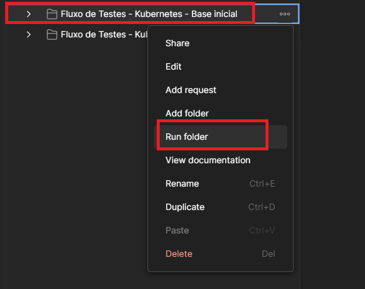
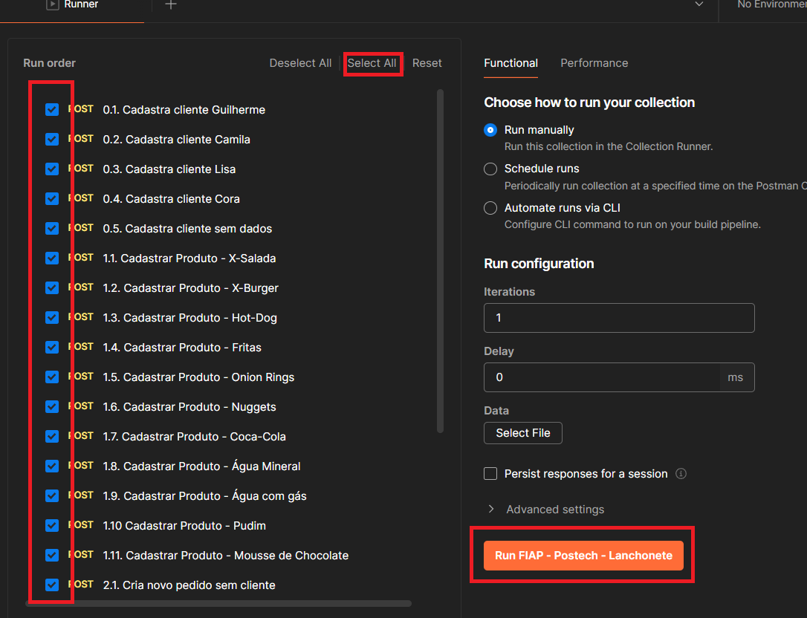
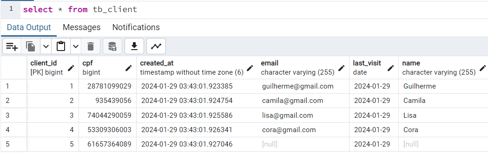
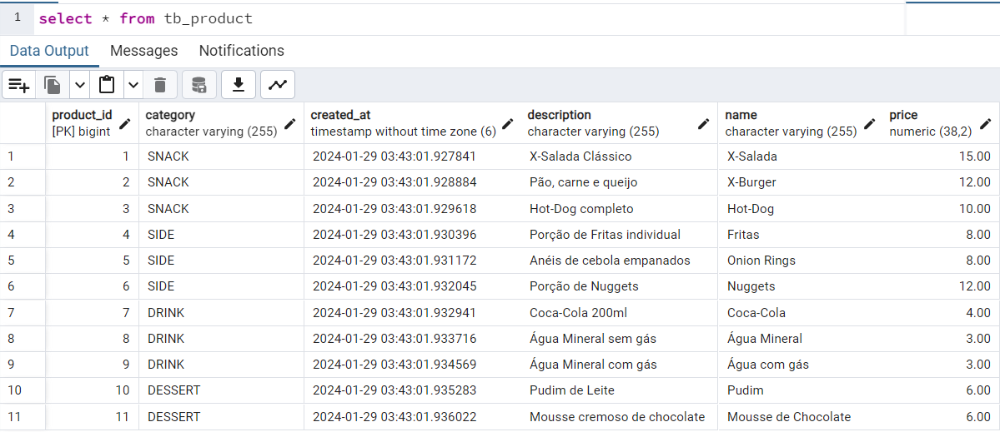
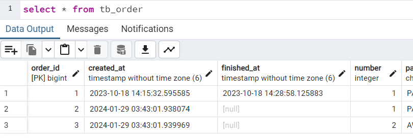
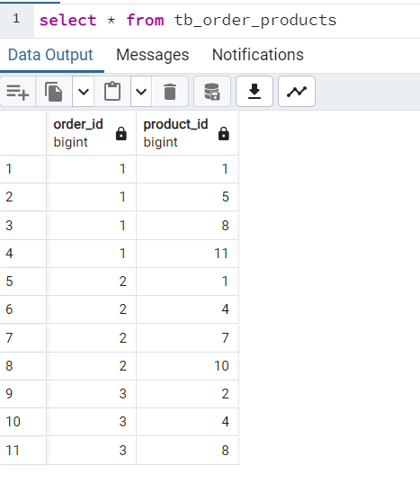
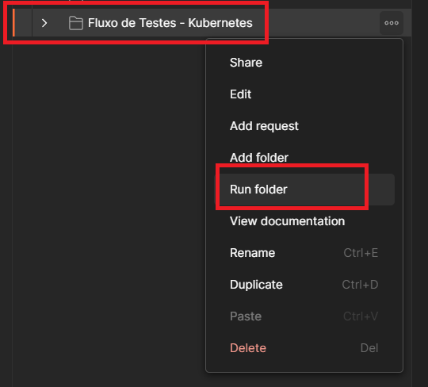
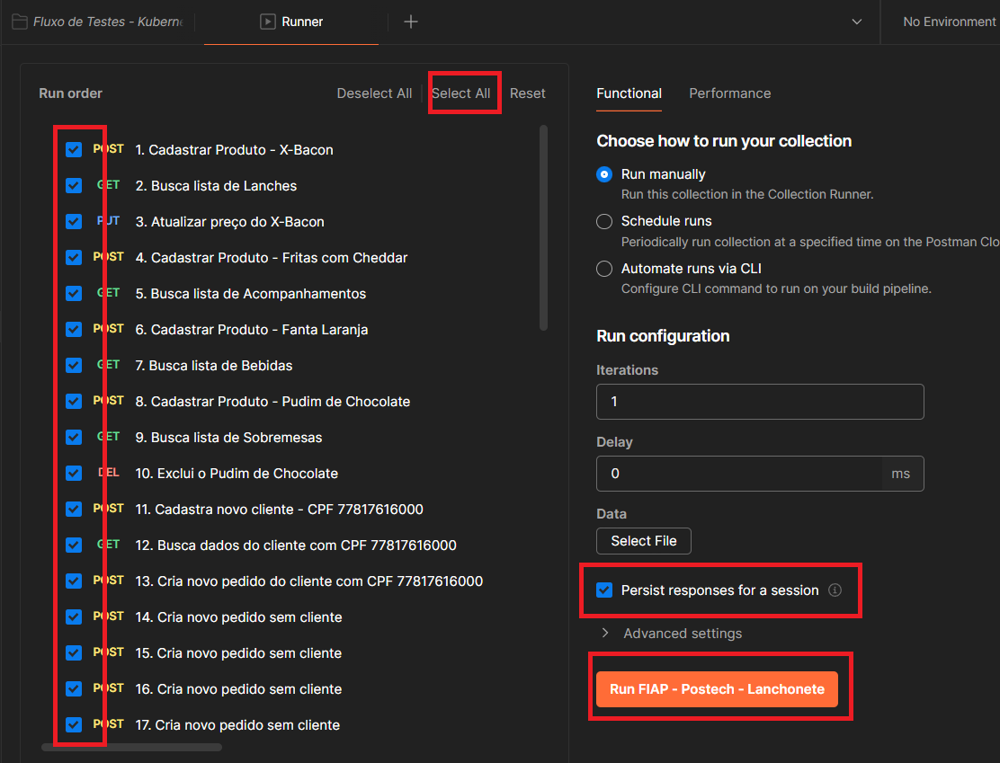
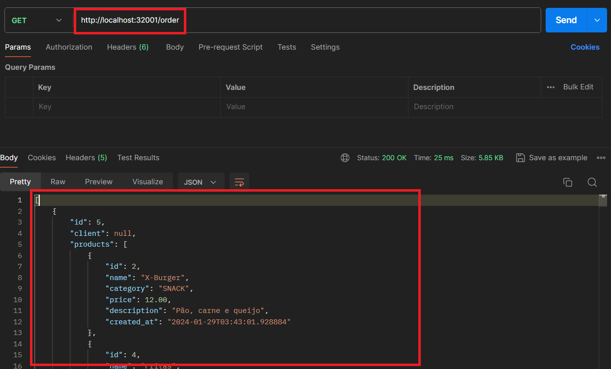
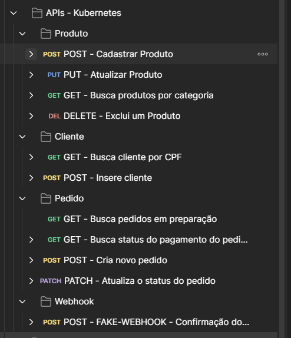

# Instruções de Testes - Tech Challenge Fase 2 - FIAP Postech

- [Instruções de Testes - Tech Challenge Fase 2 - FIAP Postech](#instruções-de-testes---tech-challenge-fase-2---fiap-postech)
  - [Pré Requisitos](#pré-requisitos)
    - [Carga de dados inicial](#carga-de-dados-inicial)
    - [Execução das funcionalidades da aplicação](#execução-das-funcionalidades-da-aplicação)

## Pré Requisitos
- Contexto da aplicação rodando no Kubernetes seguindo as instruções do [README.md](../README.md)
- Postman
- [Collection do projeto](FIAP%20-%20Postech%20-%20Lanchonete.postman_collection.json) importada no Postman

### Carga de dados inicial
Para que os testes partam de uma base já populada com uma massa mínima para os testes, é possível executar as requisições configuradas no folder "Fluxo de Testes - Kubernetes - Base inicial". Para isso,
1. Clique o botão direito no folder e em seguida clique em "Run Folder": 

2. Certifique-se que todas as requisições estão selecionadas (se necessário, clique em "Select All") e em seguida, clique em "Run FIAP - Postech - Lanchonete": 

3. Após a execução, será possível verificar, na base pelo pgAdmin ou pelos demais endpoints de consulta, que a massa inicial de dados foi criada com sucesso:  

- Tabela de clientes:  

- Tabela de produtos:  

- Tabela de pedidos: 

- Tabela de produtos dos pedidos:  

### Execução das funcionalidades da aplicação
Considerando os requisitos de entrega das APIs da segunda fase do Tech Challenge, temos os seguintes endpoints: 
APIs:

- Checkout do Pedido: POST http://localhost:32001/order; Números 13~18
- Consultar status do pagamento: GET http://localhost:32001/order/{id}/payment; Números 21, 23, 25, 27, 29, 31, 33
- Webhook de confirmação do pagamento: POST http://localhost:32001/mercadopago/webhook; Números 20, 22, 24, 26, 28, 30, 32
- Consulta dos pedidos não finalizados: GET http://localhost:32001/order; Números 19, 50
- Atualizar status do pedido: PATCH http://localhost:32001/order/{id}; Números 34~49

Para realizar a execução de um fluxo utilizando os endpoints desenvolvidos, foi criado um folder na collection do postman "Fluxo de Testes - Kubernetes" com uma ordem de execução das APIs:  

São 50 requisições que passam por uma ordem lógica de execução, sendo elas:

- Cadastro de novos produtos e exclusão: requisições 1 à 10
- Cadastro de um novo cliente: requisições 11 e 12
- Criação de novos pedidos com e sem clientes relacionados: requisições 13 à 18
- Listagem de pedidos não finalizados que retorna vazia, seguindo a regra definida: requisição 19
- Confirmação do pagamento pelo webhook Fake e consulta dos status de pagamento: requisições 20 à 33
- Atualização dos status dos pedidos criados anteriormente para que apareçam na listagem de pedidos, mantendo um cadastro de 1 pedido finalizado, 2 recebidos, 2 prontos e 2 em preparação: requisições 34 à 49
- Listagem de pedidos não finalizados retornando a lista de pedidos ordenados conforme regra definida: requisição 50

Para completar o fluxo, é possível executar cada requisição manualmente, uma a uma, ou então, como foi feito na carga inicial, é possível executar todas de uma vez através do Postman. Para isso,

1. Clique com o botão direito no folder "Fluxo de Testes - Kubernetes" e em seguida em "Run folder":  

2. Certifique-se que todas as requisições estão selecionadas (se necessário, clique em "Select All") e em seguida, clique selecione a opção "Persist responses for a session" para que seja possível visualizar as respostas das APIs, e então clique em "Run FIAP - Postech - Lanchonete":  

3. Após a execução, é possível visualizar as alterações feitas através da base, pelo pgAdmin, ou pelos demais endpoints de consulta, por exemplo, o endpoint de listagem de pedidos não finalizados:  

Além disso, caso seja necessário fazer uma requisição individualmente a alguma das APIs, na collection foi criado um folder "APIs - Kubernetes" com as estruturas de todas as requisições e exemplos de execução dos endpoints disponíveis na aplicação, separados por controllers:

